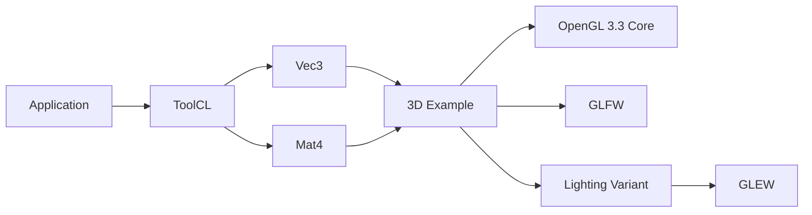

# ToolCL ⚙️

[](https://github.com/ToolGits/ToolCL)
[](https://github.com/ToolGits/ToolCL)
[](https://en.wikipedia.org/wiki/C_(programming_language))
[](https://en.wikipedia.org/wiki/C99)
[](https://cmake.org/)
[](LICENSE)

> A lightweight C framework focused on simplicity, portability, and modular development.

> [!IMPORTANT]
> **ToolCL 0.4.0 is the current stable version.**

---

## 📖 Contents

- [🚀 About](#-about)
- [✨ Features](#-features)
- [💡 Philosophy](#-philosophy)
- [🧩 Modules](#-modules)
- [🎮 3D Graphics](#-3d-graphics)
- [🧪 Examples](#-examples)
- [🔧 Build System](#-build-system)
- [📦 Basic Usage](#-basic-usage)
- [📁 Project Structure](#-project-structure)
- [🌍 Platforms](#-platforms)
- [🏢 ToolGits](#-toolgits)
- [📜 License](#-license)

---

## 🚀 About

**ToolCL** is a lightweight and modular framework written in **C99**.

It provides a collection of small, reusable components intended to make common tasks easier without introducing unnecessary complexity.

The project prioritizes:

- Simple APIs
- Small and understandable components
- Portability
- Modular development
- Minimal dependencies
- Easy maintenance

ToolCL is designed to be a **framework that stays lightweight** instead of growing into an unnecessarily complex ecosystem.

> [!NOTE]
> ToolCL is intentionally small. Not every problem needs another giant abstraction layer.

---

## ✨ Features

- ⚡ Lightweight architecture
- 🧩 Modular components
- 🔧 Written in C99
- 🏗️ Static library support
- 🔨 CMake build system
- 📦 Minimal external dependencies
- 🌍 Portability-oriented design
- 📚 Reusable APIs
- 🧪 Practical examples and experiments
- 🧊 Basic 3D math support
- 🎮 Optional OpenGL examples
- 💡 Optional lighting examples
- 🔄 VSync example variants

---

## 💡 Philosophy

ToolCL follows a simple principle:

> **Keep it small, keep it portable, keep it simple.**

The project focuses on keeping its APIs and internal structure simple, understandable, and maintainable.

ToolCL also values **compatibility and backwards compatibility**.

Whenever practical, existing APIs and behavior are preserved so that projects can continue using previous versions of the framework while newer functionality is introduced.

However, backwards compatibility is not guaranteed in every situation. Breaking changes may occasionally be necessary as ToolCL evolves.

The goal is to balance:

**Simplicity · Portability · Compatibility · Continuous Development**

---

## 🧩 Modules

ToolCL is divided into small modules, each focused on a specific purpose.

| Module | Header | Purpose |
|---|---|---|
| Logger | [`logger.h`](include/toolcl/logger.h) | Lightweight logging |
| Math | [`math.h`](include/toolcl/math.h) | Basic mathematical operations |
| Vec2 | [`vec2.h`](include/toolcl/vec2.h) | 2D vector operations |
| Vec3 | [`vec3.h`](include/toolcl/vec3.h) | 3D vector operations |
| Mat4 | [`mat4.h`](include/toolcl/mat4.h) | 4×4 matrix operations |
| String | [`string.h`](include/toolcl/string.h) | Basic C string utilities |

### Logger

Lightweight logging utilities for applications and experiments.

Provides:

- Debug logging
- Informational logging
- Warning logging
- Error logging
- Configurable log levels

### Math

Basic mathematical utilities for common operations.

Includes:

- Addition
- Subtraction
- Multiplication
- Division

Division by zero is handled deterministically by returning `0.0f`.

### Vec2

A small 2D vector module.

Provides:

- Vector creation
- Vector addition
- Vector subtraction
- Scalar multiplication
- Vector length calculation

### Vec3

A small 3D vector module introduced as part of the 3D foundation.

Provides:

- Vector creation
- Vector addition
- Vector subtraction
- Scalar multiplication
- Vector length calculation
- Vector normalization
- Dot product
- Cross product

<details>
<summary><strong>Vec3 API</strong></summary>

| Function | Description |
|---|---|
| `toolcl_vec3()` | Create a 3D vector |
| `toolcl_vec3_add()` | Add two vectors |
| `toolcl_vec3_sub()` | Subtract two vectors |
| `toolcl_vec3_mul()` | Multiply a vector by a scalar |
| `toolcl_vec3_length()` | Calculate vector length |
| `toolcl_vec3_normalize()` | Normalize a vector |
| `toolcl_vec3_dot()` | Calculate the dot product |
| `toolcl_vec3_cross()` | Calculate the cross product |

</details>

### Mat4

A 4×4 matrix module used for transformations and 3D graphics.

Provides:

- Identity matrices
- Matrix multiplication
- Translation
- Scaling
- X-axis rotation
- Y-axis rotation
- Z-axis rotation
- Perspective projection
- Vec3 transformation

<details>
<summary><strong>Mat4 API</strong></summary>

| Function | Description |
|---|---|
| `toolcl_mat4_identity()` | Create an identity matrix |
| `toolcl_mat4_mul()` | Multiply two matrices |
| `toolcl_mat4_translate()` | Create a translation matrix |
| `toolcl_mat4_scale()` | Create a scale matrix |
| `toolcl_mat4_rotate_x()` | Create an X-axis rotation matrix |
| `toolcl_mat4_rotate_y()` | Create a Y-axis rotation matrix |
| `toolcl_mat4_rotate_z()` | Create a Z-axis rotation matrix |
| `toolcl_mat4_perspective()` | Create a perspective projection matrix |
| `toolcl_mat4_transform_vec3()` | Transform a 3D vector |

> [!NOTE]
> ToolCL's Mat4 implementation uses column-major matrices and column vectors following the conventions commonly used by OpenGL.

</details>

### String

Basic utilities for working with C strings.

Provides:

- String length
- String comparison

The module also provides defined behavior for `NULL` inputs.

---

## 🎮 3D Graphics

ToolCL 0.4.0 introduces a small 3D foundation through **Vec3** and **Mat4**.

The 3D examples demonstrate how ToolCL's mathematical modules can be combined with **OpenGL 3.3 Core**.

The examples use:

- OpenGL 3.3 Core
- GLFW
- GLEW for lighting variants
- VAO/VBO rendering
- GLSL shaders
- Depth testing
- ToolCL Vec3
- ToolCL Mat4

> [!IMPORTANT]
> The OpenGL examples are optional. OpenGL, GLFW and GLEW are **not required** for the ToolCL core library.

### 3D Architecture



### 3D Examples

| Example | OpenGL | Vec3 | Mat4 | Lighting | VSync |
|---|:---:|:---:|:---:|:---:|:---:|
| [`hello_3d`](examples/hello_3d.c) | ✅ | — | ✅ | — | ❌ |
| [`hello_3d_vsync`](examples/hello_3d_vsync.c) | ✅ | — | ✅ | — | ✅ |
| [`hello_3d_lighting`](examples/hello_3d_lighting.c) | ✅ | ✅ | ✅ | ✅ | ❌ |
| [`hello_3d_lighting_vsync`](examples/hello_3d_lighting_vsync.c) | ✅ | ✅ | ✅ | ✅ | ✅ |

<details>
<summary><strong>About the 3D variants</strong></summary>

#### `hello_3d`

Basic OpenGL 3D example with:

- Colored cube
- Depth testing
- Model/View/Projection transformations
- VSync disabled

#### `hello_3d_vsync`

The basic 3D example with VSync enabled.

```c
glfwSwapInterval(1);
```

#### `hello_3d_lighting`

Adds directional lighting using:

- Vec3 normals
- Vec3 light direction
- GLSL lighting calculations
- Ambient lighting
- Diffuse lighting
- VSync disabled

#### `hello_3d_lighting_vsync`

Lighting variant with VSync enabled.

</details>

---

## 🧪 Examples

ToolCL includes several examples demonstrating its modules and experimental ideas.

### Library examples

| Example | Description |
|---|---|
| `hello_logger` | Logger demonstration |
| `hello_math` | Math utilities demonstration |
| `hello_vec2` | 2D vector demonstration |
| `hello_string` | String utilities demonstration |

### Experimental examples

| Example | Description |
|---|---|
| `hello_world` | Interactive experiment focused on input and interaction |
| `hello_random` | Experiment focused on randomness |

The experimental examples are intentionally kept as small practical programs for testing concepts and experimenting with ToolCL.

### 3D examples

The optional 3D examples are documented in the [3D Graphics](#-3d-graphics) section.

---

## 🔧 Build System

ToolCL uses **CMake** as its official build system.

### Requirements

For the core library:

- A C99-compatible C compiler
- CMake 3.10 or newer

For the optional 3D examples:

- OpenGL development libraries
- GLFW development libraries
- GLEW development libraries

> [!NOTE]
> The exact system packages depend on the operating system and distribution.

### Build

From the project root:

```bash
cmake -S . -B build
cmake --build build
```

The generated files are kept inside the `build/` directory.

The static library is generated as:

```text
build/lib/libtoolcl.a
```

Example executables are generated inside:

```text
build/bin/
```

### Build without examples

If you only need the ToolCL library:

```bash
cmake -S . -B build \
    -DTOOLCL_BUILD_EXAMPLES=OFF

cmake --build build
```

> [!TIP]
> Disabling examples is useful when ToolCL is being integrated as a library into another project.

### Build the 3D examples

To build the optional OpenGL examples:

```bash
cmake -S . -B build \
    -DTOOLCL_BUILD_EXAMPLES=ON \
    -DTOOLCL_BUILD_3D_EXAMPLE=ON

cmake --build build
```

> [!IMPORTANT]
> Make sure the required OpenGL, GLFW and GLEW development packages are installed before enabling the 3D examples.

### CMake Options

| Option | Default | Description |
|---|:---:|---|
| `TOOLCL_BUILD_EXAMPLES` | `ON` | Build standard examples |
| `TOOLCL_BUILD_3D_EXAMPLE` | `OFF` | Build optional OpenGL 3D examples |

---

## 📦 Basic Usage

After building ToolCL, applications can include its public headers through the `toolcl/` include path.

For example:

```c
#include <toolcl/math.h>
#include <stdio.h>

int main(void)
{
    float result = toolcl_addf(10.0f, 5.0f);

    printf("Result: %.2f\n", result);

    return 0;
}
```

### Using Vec3

```c
#include <toolcl/vec3.h>

int main(void)
{
    ToolCL_Vec3 position = toolcl_vec3(1.0f, 2.0f, 3.0f);
    ToolCL_Vec3 direction = toolcl_vec3(0.0f, 1.0f, 0.0f);

    ToolCL_Vec3 result =
        toolcl_vec3_add(position, direction);

    (void)result;

    return 0;
}
```

### Using Mat4

```c
#include <toolcl/mat4.h>

int main(void)
{
    ToolCL_Mat4 model =
        toolcl_mat4_translate(0.0f, 0.0f, -5.0f);

    ToolCL_Mat4 projection =
        toolcl_mat4_perspective(
            45.0f * 3.14159265358979323846f / 180.0f,
            16.0f / 9.0f,
            0.1f,
            100.0f
        );

    ToolCL_Mat4 transform =
        toolcl_mat4_mul(projection, model);

    (void)transform;

    return 0;
}
```

The exact API may grow as new ToolCL versions are released while keeping the project focused on small and understandable interfaces.

---

## 📁 Project Structure

```text
ToolCL/
├── include/
│   └── toolcl/
│       ├── logger.h
│       ├── math.h
│       ├── string.h
│       ├── vec2.h
│       ├── vec3.h
│       └── mat4.h
├── src/
│   ├── logger.c
│   ├── math.c
│   ├── string.c
│   ├── vec2.c
│   ├── vec3.c
│   └── mat4.c
├── examples/
│   ├── hello_logger.c
│   ├── hello_math.c
│   ├── hello_random.c
│   ├── hello_string.c
│   ├── hello_vec2.c
│   ├── hello_world.c
│   ├── hello_3d.c
│   ├── hello_3d_vsync.c
│   ├── hello_3d_lighting.c
│   └── hello_3d_lighting_vsync.c
├── CMakeLists.txt
├── README.md
└── LICENSE
```

---

## 🌍 Platforms

ToolCL follows a portability-oriented design.

### Current

- 🐧 Linux

### Planned / Improving

- 🪟 Windows
- 🌎 Other compatible platforms

Platform-specific dependencies are intentionally kept to a minimum whenever possible.

> [!NOTE]
> The core library is designed to remain independent from platform-specific graphics APIs.

---

## 🏢 ToolGits

ToolCL is maintained by the **ToolGits** organization.

ToolCL is an independent project within the ToolGits family, with its own architecture, goals, and development direction.

- Organization: https://github.com/ToolGits
- Creator: https://github.com/enzobobdevvideos04-ctrl
- Discord: https://discord.gg/NJY5BaxMZq

---

## 📜 License

ToolCL is licensed under the **MIT License**.

See [`LICENSE`](LICENSE) for the full license text.

---

<p align="center">
  <strong>ToolCL — Keep it small, keep it portable, keep it simple. ⚙️</strong>
</p>