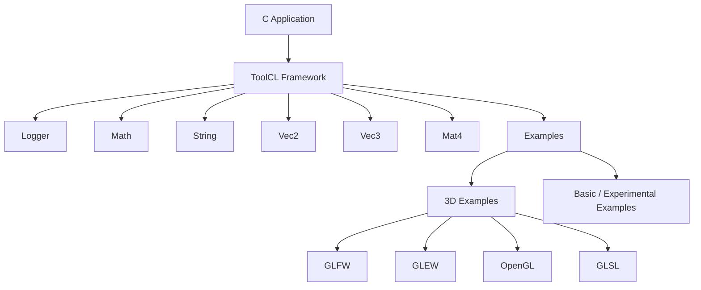

<div align="center">

# ToolCL

### Keep it small. Keep it portable. Keep it simple.

A lightweight, modular and portable **C99 framework** for building practical C applications without unnecessary complexity.

[](https://github.com/ToolGits/ToolCL)
[](https://en.wikipedia.org/wiki/C99)
[](https://cmake.org/)
[](LICENSE)

</div>

> [!NOTE]
> ToolCL is a **framework**, not a general-purpose collection of everything a C application might need. Its goal is to provide a small and coherent foundation that can grow without becoming unnecessarily complicated.

> [!TIP]
> The core framework does not require graphics libraries. OpenGL, GLFW and GLEW are only introduced when the optional 3D examples are enabled.

> [!IMPORTANT]
> ToolCL currently focuses primarily on Linux. Windows support is part of the portability direction and is still evolving.

---

# Table of Contents

- [Overview](#overview)
- [Why ToolCL?](#why-toolcl)
- [Features](#features)
- [Architecture](#architecture)
- [Modules](#modules)
- [3D Foundation](#3d-foundation)
- [Examples](#examples)
- [Requirements](#requirements)
- [Building](#building)
- [CMake Options](#cmake-options)
- [CMake Presets](#cmake-presets)
- [Testing](#testing)
- [Basic Usage](#basic-usage)
- [Project Structure](#project-structure)
- [Portability](#portability)
- [Development](#development)
- [ToolGits](#toolgits)
- [License](#license)

---

# Overview

ToolCL is a small C99 framework designed around a simple idea:

> **Provide useful foundations without turning the project into a massive dependency.**

The framework currently focuses on core utilities, mathematics, vectors, matrices, logging and optional OpenGL-based 3D examples.

## Core Architecture

| Area | Purpose |
|---|---|
| Logger | Lightweight application logging |
| Math | Basic numerical utilities and common mathematical operations |
| String | Small string-related helpers |
| Vec2 | 2D vector operations |
| Vec3 | 3D vector operations |
| Mat4 | 4×4 matrix operations and transformations |
| 3D Examples | Optional OpenGL demonstrations and rendering foundations |
| Tests | Automated validation of the framework's core components |

The core is intentionally independent from the optional graphics stack.

<details>
<summary><strong>Framework layout</strong></summary>

```text
ToolCL
├── Core
│   ├── Logger
│   ├── Math
│   ├── String
│   ├── Vec2
│   ├── Vec3
│   └── Mat4
│
├── Examples
│   ├── Experimental
│   │   ├── hello_world
│   │   └── hello_random
│   │
│   └── 3D
│       ├── hello_3d
│       ├── hello_3d_vsync
│       ├── hello_3d_lighting
│       └── hello_3d_lighting_vsync
│
├── Tests
│   ├── test_logger
│   ├── test_math
│   ├── test_string
│   ├── test_vec
│   └── test_mat4
│
└── Build
    ├── CMakeLists.txt
    └── CMakePresets.json
```

</details>

---

# Why ToolCL?

ToolCL was created to provide a small and practical foundation for C applications without introducing unnecessary complexity.

### Small by design

ToolCL focuses on useful building blocks instead of trying to provide everything in a single framework.

### Portable by default

Built around **C99** and a small dependency footprint, ToolCL is designed to keep applications portable across different environments.

### Modular

Components such as logging, mathematics, strings, vectors and matrices are organized independently, allowing the framework to grow without becoming unnecessarily complex.

### Optional 3D

The core does not depend on graphics libraries. OpenGL-related dependencies are only required when the optional 3D examples are enabled.

### Tested

ToolCL includes automated tests for its core components, including mathematical edge cases, vector operations and matrix transformations.

### Built to stay simple

ToolCL follows a straightforward philosophy:

> **Keep it small. Keep it portable. Keep it simple.**

---

# Features

## Core

- C99-based framework
- Modular source organization
- Lightweight logging
- Mathematical utilities
- 2D and 3D vector types
- 4×4 matrix operations
- String utilities
- Static framework target
- Minimal mandatory dependencies

## Mathematics

The math foundation includes:

- Basic arithmetic
- Safe floating-point division behavior
- Absolute values
- Minimum and maximum values
- Clamping
- Linear interpolation
- Trigonometric helpers
- Square-root handling
- Degree/radian conversion
- Vector length and distance calculations
- Dot and cross products

## Transformations

`Mat4` provides the foundations required by the 3D examples:

- Identity matrices
- Zero matrices
- Matrix multiplication
- Translation
- Scaling
- X/Y/Z rotations
- Perspective projection
- 3D vector transformation

## 3D

The optional 3D layer demonstrates:

- OpenGL rendering
- GLFW window/context management
- GLEW-based OpenGL loading
- GLSL shaders
- Perspective projection
- Model/View/Projection transformations
- VSync
- Directional lighting
- Specular lighting
- Shadow mapping
- PCF shadow filtering
- Polygon offset for shadow-map stability

---

# Architecture

ToolCL keeps its core independent from the graphics examples.


```mermaid
flowchart TD
    APP["C Application"]

    TOOLCL["ToolCL Framework"]

    LOGGER["Logger"]
    MATH["Math"]
    STRING["String"]
    VEC2["Vec2"]
    VEC3["Vec3"]
    MAT4["Mat4"]

    EXAMPLES["Examples"]

    CORE3D["3D Examples"]
    BASIC["Basic / Experimental Examples"]

    GLFW["GLFW"]
    GLEW["GLEW"]
    OPENGL["OpenGL"]
    GLSL["GLSL"]

    APP --> TOOLCL

    TOOLCL --> LOGGER
    TOOLCL --> MATH
    TOOLCL --> STRING
    TOOLCL --> VEC2
    TOOLCL --> VEC3
    TOOLCL --> MAT4

    TOOLCL --> EXAMPLES

    EXAMPLES --> BASIC
    EXAMPLES --> CORE3D

    CORE3D --> GLFW
    CORE3D --> GLEW
    CORE3D --> OPENGL
    CORE3D --> GLSL
```

The important separation is:

```text
ToolCL Core
    │
    ├── Logger
    ├── Math
    ├── String
    ├── Vec2
    ├── Vec3
    └── Mat4

Optional 3D Examples
    │
    ├── GLFW
    ├── GLEW
    ├── OpenGL
    └── GLSL
```

This means applications using only the core do not need to bring the 3D stack with them.

---

# Modules

## Logger

The logger provides lightweight diagnostic output for applications and examples.

Its purpose is to make framework and application behavior easier to inspect without introducing a large logging system.

Typical use cases include:

- Informational messages
- Warnings
- Errors
- Debugging framework behavior
- Example application output

---

## Math

The math module provides small numerical helpers used throughout the framework.

It covers:

- Arithmetic operations
- Absolute values
- Minimum/maximum
- Clamping
- Linear interpolation
- Trigonometric functions
- Square roots
- Degree/radian conversion

The module also defines the framework's mathematical constant:

```c
TOOLCL_PI
```

Edge cases such as division by zero, negative square roots and inverted clamp bounds are covered by the test suite.

---

## String

The string module provides lightweight helpers for common string operations.

The module is intended to cover common application needs without attempting to replace the C standard library.

---

## Vec2

`ToolCL_Vec2` represents a two-dimensional vector.

Supported operations include:

- Construction
- Addition
- Subtraction
- Scalar multiplication
- Length
- Dot product
- Distance
- Normalization

Example:

```c
ToolCL_Vec2 a = toolcl_vec2(3.0f, 4.0f);
ToolCL_Vec2 b = toolcl_vec2(1.0f, 2.0f);

ToolCL_Vec2 result = toolcl_vec2_add(a, b);
```

---

## Vec3

`ToolCL_Vec3` represents a three-dimensional vector.

Supported operations include:

- Construction
- Addition
- Subtraction
- Scalar multiplication
- Length
- Dot product
- Distance
- Cross product
- Normalization

Example:

```c
ToolCL_Vec3 a = toolcl_vec3(1.0f, 0.0f, 0.0f);
ToolCL_Vec3 b = toolcl_vec3(0.0f, 1.0f, 0.0f);

ToolCL_Vec3 normal = toolcl_vec3_cross(a, b);
```

Vector length and distance calculations use numerically safer `hypotf`-based calculations.

---

## Mat4

`ToolCL_Mat4` provides 4×4 matrix operations used by the 3D foundation.

Supported operations include:

- Zero matrix
- Identity matrix
- Matrix multiplication
- Translation
- Scaling
- X rotation
- Y rotation
- Z rotation
- Perspective projection
- 3D vector transformation

Perspective projection validates its parameters before constructing the matrix, including:

- Field of view
- Aspect ratio
- Near plane
- Far plane
- Finite floating-point values

Vector transformation also protects against non-finite homogeneous `w` values.

---

# 3D Foundation

The 3D examples are optional and are designed to demonstrate how the ToolCL mathematics layer can be used with a conventional OpenGL rendering pipeline.

## 3D Stack

| Component | Role |
|---|---|
| OpenGL | Rendering API |
| GLFW | Window and context management |
| GLEW | OpenGL extension/function loading |
| GLSL | Shader programming |
| ToolCL Math | Vectors and matrices |
| ToolCL Mat4 | Transform and projection operations |

## Rendering Pipeline

The examples use the familiar transformation flow:

```text
Model
  │
  ▼
View
  │
  ▼
Projection
  │
  ▼
Clip Space
  │
  ▼
OpenGL Rasterization
```

The `Mat4` module supplies the transformation foundation for this process.

---

## Perspective Projection

The perspective examples demonstrate a conventional perspective matrix using:

```text
Field of View
Aspect Ratio
Near Plane
Far Plane
```

Invalid values are rejected instead of allowing invalid matrices to propagate through the rendering pipeline.

---

## Lighting

The lighting examples demonstrate a basic directional-light model.

The rendering pipeline can include:

```text
Vertex Position
       │
       ▼
   Model/View
       │
       ▼
   Projection
       │
       ▼
   Fragment Shader
       │
       ├── Diffuse Lighting
       ├── Specular Lighting
       └── Shadow Contribution
```

---

## Shadow Mapping

The advanced lighting example demonstrates shadow mapping.

The general process is:

```text
Light Space
    │
    ▼
Shadow Map
    │
    ▼
Fragment Position
    │
    ▼
Depth Comparison
    │
    ▼
Shadow Factor
```

PCF filtering can be used to reduce hard shadow-map edges by sampling neighboring depth values.

Polygon offset is also used where appropriate to reduce common depth precision artifacts such as shadow acne.

---

## VSync

The VSync examples demonstrate synchronization between rendering and the display refresh cycle.

Available variants include:

- `hello_3d_vsync`
- `hello_3d_lighting_vsync`

The non-VSync versions are also available for comparison.

---

# Examples

ToolCL includes small examples ranging from basic framework usage to complete OpenGL demonstrations.

## Basic Examples

### `hello_world`

A minimal ToolCL application.

### `hello_random`

A simple example demonstrating basic framework functionality with generated values.

---

## 3D Examples

| Example | Description |
|---|---|
| `hello_3d` | Basic OpenGL 3D rendering |
| `hello_3d_vsync` | Basic 3D rendering with VSync |
| `hello_3d_lighting` | 3D rendering with lighting and shadows |
| `hello_3d_lighting_vsync` | Lighting example with VSync |

The repository also contains additional focused example sources for individual modules, such as:

```text
examples/
├── experimental/
│   ├── hello_world.c
│   └── hello_random.c
│
└── 3d/
    ├── hello_3d.c
    ├── hello_3d_vsync.c
    ├── hello_3d_lighting.c
    └── hello_3d_lighting_vsync.c
```

Module-specific examples may exist in the source tree without being registered as top-level CMake targets.

---

# Requirements

## Core

To build the ToolCL core:

- C99-compatible compiler
- CMake 3.25 or newer
- Standard C library
- Unix-like environment recommended

## 3D Examples

The optional 3D examples additionally require:

- OpenGL development files
- GLFW
- GLEW
- OpenGL-capable environment

When enabled, CMake can fetch missing GLFW/GLEW dependencies through `FetchContent`.

> [!NOTE]
> The 3D examples are optional. Core development and core tests can be built with 3D disabled.

---

# Building

Clone the repository:

```bash
git clone https://github.com/ToolGits/ToolCL.git
cd ToolCL
```

## Basic Build

For a normal build without the optional 3D layer:

```bash
cmake -S . -B build \
  -DTOOLCL_BUILD_EXAMPLES=ON \
  -DTOOLCL_BUILD_3D=OFF \
  -DTOOLCL_BUILD_TESTS=ON

cmake --build build -j"$(nproc)"
```

Run the tests:

```bash
ctest --test-dir build --output-on-failure
```

---

## Full Build

To build the complete project, including the 3D examples:

```bash
cmake -S . -B build \
  -DTOOLCL_BUILD_EXAMPLES=ON \
  -DTOOLCL_BUILD_3D=ON \
  -DTOOLCL_BUILD_TESTS=ON

cmake --build build -j"$(nproc)"
```

Then:

```bash
ctest --test-dir build --output-on-failure
```

---

## Clean Build

When a completely fresh build is desired:

```bash
rm -rf build

cmake -S . -B build \
  -DTOOLCL_BUILD_EXAMPLES=ON \
  -DTOOLCL_BUILD_3D=ON \
  -DTOOLCL_BUILD_TESTS=ON

cmake --build build -j"$(nproc)"
```

---

# CMake Options

ToolCL exposes the following main configuration options:

| Option | Default | Description |
|---|---:|---|
| `TOOLCL_BUILD_EXAMPLES` | `ON` | Build example programs |
| `TOOLCL_BUILD_3D` | `ON` | Build OpenGL 3D examples |
| `TOOLCL_BUILD_TESTS` | `ON` | Build and register tests |
| `TOOLCL_FETCH_3D_DEPS` | `ON` | Fetch GLFW/GLEW when unavailable |

For example, to build only the core and tests:

```bash
cmake -S . -B build \
  -DTOOLCL_BUILD_EXAMPLES=OFF \
  -DTOOLCL_BUILD_3D=OFF \
  -DTOOLCL_BUILD_TESTS=ON
```

---

# CMake Presets

ToolCL includes `CMakePresets.json` for common development configurations.

## Debug

```bash
cmake --preset debug
cmake --build --preset debug
ctest --preset debug
```

The debug preset enables:

- Debug build
- Tests
- Examples
- Core-only configuration

3D is disabled so the preset remains suitable for environments without a graphics development stack.

---

## Release

```bash
cmake --preset release
cmake --build --preset release
ctest --preset release
```

The release preset provides an optimized core-oriented configuration while keeping tests and examples enabled.

---

## 3D

```bash
cmake --preset 3d
cmake --build --preset 3d
ctest --preset 3d
```

The 3D preset enables:

- Release build
- Tests
- Examples
- OpenGL 3D examples

---

# Testing

ToolCL uses CTest for automated testing.

The current test suite is organized into five main test programs:

| Test | Coverage |
|---|---|
| `test_logger` | Logger behavior |
| `test_math` | Mathematical utilities and edge cases |
| `test_string` | String utilities |
| `test_vec` | Vec2 and Vec3 operations |
| `test_mat4` | Matrix operations and transformations |

## Math Edge Cases

The math tests cover cases such as:

- Division by zero
- Negative square roots
- Inverted clamp bounds
- Arithmetic operations
- Interpolation
- Angle conversion

## Vector Tests

Vector tests cover:

- Construction
- Addition
- Subtraction
- Scalar multiplication
- Length
- Distance
- Dot product
- Cross product
- Normalization
- Zero-vector normalization

## Matrix Tests

Matrix tests cover:

- Identity matrices
- Zero matrices
- Matrix multiplication
- Translation
- Scaling
- Rotation
- Perspective projection
- Vector transformation
- Invalid perspective parameters
- Non-finite transformation values

Run all tests with:

```bash
ctest --test-dir build --output-on-failure
```

Or, using the debug preset:

```bash
ctest --preset debug
```

---

# Basic Usage

A minimal ToolCL program can look like this:

```c
#include <toolcl/logger.h>
#include <toolcl/vec3.h>

int main(void)
{
    ToolCL_Vec3 a = toolcl_vec3(1.0f, 2.0f, 3.0f);
    ToolCL_Vec3 b = toolcl_vec3(4.0f, 5.0f, 6.0f);

    ToolCL_Vec3 result = toolcl_vec3_add(a, b);

    toolcl_log_info(
        "Result: %.2f %.2f %.2f",
        result.x,
        result.y,
        result.z
    );

    return 0;
}
```

Compile the application against the ToolCL framework target:

```cmake
add_executable(my_app main.c)

target_link_libraries(my_app PRIVATE toolcl)
```

The framework exposes its headers through the `include/` directory.

---

# Project Structure

The repository is organized around the framework core, examples and tests:

```text
ToolCL/
├── CMakeLists.txt
├── CMakePresets.json
├── LICENSE
├── README.md
│
├── include/
│   └── toolcl/
│       ├── logger.h
│       ├── math.h
│       ├── string.h
│       ├── vec2.h
│       ├── vec3.h
│       └── mat4.h
│
├── src/
│   ├── logger.c
│   ├── math.c
│   ├── string.c
│   ├── vec2.c
│   ├── vec3.c
│   └── mat4.c
│
├── examples/
│   ├── experimental/
│   │   ├── hello_world.c
│   │   └── hello_random.c
│   │
│   └── 3d/
│       ├── hello_3d.c
│       ├── hello_3d_vsync.c
│       ├── hello_3d_lighting.c
│       └── hello_3d_lighting_vsync.c
│
└── tests/
    ├── test_logger.c
    ├── test_math.c
    ├── test_string.c
    ├── test_vec.c
    └── test_mat4.c
```

Build artifacts are generated inside the selected build directory and are not part of the source tree.

---

# Portability

ToolCL is built around C99 and aims to keep its core portable.

## Current Direction

```text
                    ToolCL
                      │
          ┌───────────┴───────────┐
          │                       │
        Linux                Windows
          │                       │
     Primary focus          Support evolving
```

The core framework intentionally avoids unnecessary platform-specific dependencies.

The optional 3D layer naturally depends on the graphics environment available on the target platform.

> [!NOTE]
> Platform support should be considered separately from graphics support. A platform may be able to build the ToolCL core without necessarily having the OpenGL development environment required by the 3D examples.

---

# Development

ToolCL development follows a few practical principles.

## Keep the Core Focused

New functionality should have a clear reason to exist in the framework.

ToolCL should not grow simply for the sake of adding more modules.

## Prefer Portable C

The framework targets C99 and should avoid unnecessary compiler-specific features when a portable solution is practical.

## Test Changes

Changes to core functionality should be accompanied by appropriate tests.

For example:

```text
Implementation
     │
     ▼
Tests
     │
     ▼
CMake / Build
     │
     ▼
CTest
```

## Validate Edge Cases

Small utilities can still fail in important ways when given unusual input.

ToolCL therefore pays attention to cases such as:

- Zero values
- Invalid ranges
- Division by zero
- Negative square-root input
- Zero-length vectors
- Invalid perspective parameters
- Non-finite floating-point values

## Keep Examples Honest

Examples should demonstrate functionality without pretending to be production engines.

The 3D examples are demonstrations of the framework's mathematical and rendering foundations, not a complete game engine or graphics engine.

---

# ToolGits

ToolCL is developed under the **ToolGits** organization.

**Organization:** [ToolGits](https://github.com/ToolGits)

**Creator:** [enzobobdevvideos04-ctrl](https://github.com/enzobobdevvideos04-ctrl)

ToolCL was created by **enzobobdevvideos04-ctrl** as part of the ToolGits project ecosystem.

---

# License

ToolCL is released under the **MIT License**.

See [`LICENSE`](LICENSE) for the complete license text.

---

<div align="center">

### ToolCL

**Keep it small. Keep it portable. Keep it simple.**

Created by [enzobobdevvideos04-ctrl](https://github.com/enzobobdevvideos04-ctrl)

Part of [ToolGits](https://github.com/ToolGits)

</div>