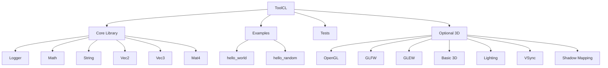
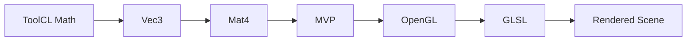
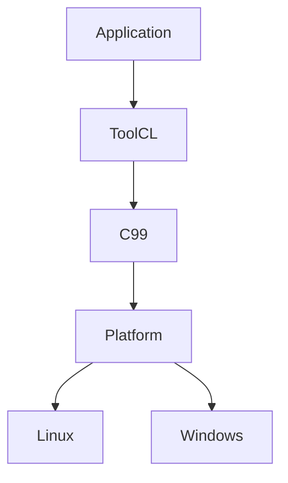

<div align="center">

# ToolCL

### Keep it small. Keep it portable. Keep it simple.

A lightweight C99 library for building portable applications with a modular API, mathematics utilities, logging, strings, vectors, matrices and optional 3D/OpenGL examples.

[](https://github.com/ToolGits/ToolCL/releases)
[](https://en.cppreference.com/w/c)
[](https://cmake.org/)
[](LICENSE)
[](#portability)

</div>

---

> [!NOTE]
> **ToolCL v0.4.5** is the current stable release.

> [!TIP]
> ToolCL is designed around a simple idea: provide useful building blocks without turning a small C project into a giant dependency tree.

> [!IMPORTANT]
> The core library does not require OpenGL, GLFW or GLEW. The 3D stack is optional and controlled through CMake options.

---

## Table of Contents

- [Overview](#overview)
- [Features](#features)
- [Architecture](#architecture)
- [Modules](#modules)
- [API](#api)
  - [Logger](#logger)
  - [Math](#math)
  - [String](#string)
  - [Vec2](#vec2)
  - [Vec3](#vec3)
  - [Mat4](#mat4)
- [3D Foundation](#3d-foundation)
- [Examples](#examples)
- [Requirements](#requirements)
- [Building](#building)
- [CMake Options](#cmake-options)
- [CMake Presets](#cmake-presets)
- [Testing](#testing)
- [Basic Usage](#basic-usage)
- [Project Structure](#project-structure)
- [Portability](#portability)
- [Development](#development)
- [ToolGits](#toolgits)
- [License](#license)

---

# Overview

**ToolCL** is a lightweight C99 library created by **enzobobdevvideos04-ctrl** under the **ToolGits** organization.

It provides a small collection of reusable building blocks for C applications while keeping the core simple, portable and dependency-light.

### ToolCL Architecture at a Glance

| Layer | Components | Purpose |
|---|---|---|
| **Core** | `Logger` · `Math` · `String` | Fundamental utilities |
| **Vectors** | `Vec2` · `Vec3` | 2D and 3D vector mathematics |
| **Matrices** | `Mat4` | 4×4 transformations and 3D math |
| **3D Layer** | `OpenGL` · `GLFW` · `GLEW` | Optional real-time 3D examples |
| **Examples** | `hello_world` · `hello_random` · 3D examples | Usage and demonstrations |
| **Tests** | Logger · Math · String · Vec · Mat4 | Automated validation |

<details>
<summary><strong>ToolCL structure</strong></summary>

```text
ToolCL
│
├── Core
│   ├── Logger
│   ├── Math
│   └── String
│
├── Mathematics
│   ├── Vec2
│   ├── Vec3
│   └── Mat4
│
├── Optional 3D Layer
│   ├── OpenGL
│   ├── GLFW
│   └── GLEW
│
├── Examples
│   ├── hello_world
│   ├── hello_random
│   └── 3D examples
│
└── Tests
    ├── Logger
    ├── Math
    ├── String
    ├── Vec
    └── Mat4
```

</details>

The architecture is intentionally modular: applications can use the core functionality without enabling the optional 3D layer.

> [!NOTE]
> OpenGL, GLFW and GLEW are **not required by the ToolCL core library**. They are only used by the optional 3D examples.

---

# Features

## Core

- C99-compatible API
- Static library target
- Lightweight implementation
- Modular headers
- Logging system
- Mathematical helpers
- String helpers
- Vector mathematics
- Matrix mathematics
- Linear interpolation
- Angle conversion
- Transform utilities

## 3D

The optional 3D layer provides examples using:

- OpenGL
- GLFW
- GLEW
- GLSL
- Perspective projection
- Model/view/projection matrices
- Directional lighting
- Shadow mapping
- PCF filtering
- Basic specular lighting
- VSync variants

## Build System

- CMake 3.16+
- CMake Presets
- Optional examples
- Optional 3D examples
- Optional tests
- Optional dependency fetching
- `pkg-config` integration when available

---

# Architecture


```mermaid
flowchart TD
    A[ToolCL] --> B[Core Library]
    A --> C[Examples]
    A --> D[Tests]
    A --> E[Optional 3D]

    B --> B1[Logger]
    B --> B2[Math]
    B --> B3[String]
    B --> B4[Vec2]
    B --> B5[Vec3]
    B --> B6[Mat4]

    C --> C1[hello_world]
    C --> C2[hello_random]

    E --> E1[OpenGL]
    E --> E2[GLFW]
    E --> E3[GLEW]

    E --> E4[Basic 3D]
    E --> E5[Lighting]
    E --> E6[VSync]
    E --> E7[Shadow Mapping]
```

---

# Modules

| Module | Header | Purpose |
|---|---|---|
| Logger | `toolcl/logger.h` | Logging and log levels |
| Math | `toolcl/math.h` | Mathematical helpers |
| String | `toolcl/string.h` | String utilities |
| Vec2 | `toolcl/vec2.h` | 2D vector operations |
| Vec3 | `toolcl/vec3.h` | 3D vector operations |
| Mat4 | `toolcl/mat4.h` | 4×4 matrix operations |

---

# API

## Logger

Header:

```c
#include <toolcl/logger.h>
```

ToolCL provides four primary log levels:

| Level | Purpose |
|---|---|
| `DEBUG` | Detailed debugging information |
| `INFO` | General information |
| `WARN` | Warnings |
| `ERROR` | Errors |

The logger also provides a legacy logging function with the `[ToolCL]` prefix.

Example:

```c
toolcl_log("Hello from ToolCL!");

toolcl_log_debug("Debug message");
toolcl_log_info("Information");
toolcl_log_warn("Warning");
toolcl_log_error("Error");
```

The global minimum log level can be configured so messages below the selected level are ignored.

---

## Math

Header:

```c
#include <toolcl/math.h>
```

ToolCL provides basic mathematical helpers.

### Constants

| Symbol | Description |
|---|---|
| `TOOLCL_PI` | π constant |

### Arithmetic

```c
toolcl_math_add()
toolcl_math_sub()
toolcl_math_mul()
toolcl_math_div()
```

### Utility

```c
toolcl_math_abs()
toolcl_math_min()
toolcl_math_max()
toolcl_math_clamp()
toolcl_math_lerp()
```

### Trigonometry

```c
toolcl_math_sin()
toolcl_math_cos()
toolcl_math_tan()
toolcl_math_sqrt()
```

### Angles

```c
toolcl_radians()
toolcl_degrees()
```

Example:

```c
float angle = toolcl_radians(90.0f);
float value = toolcl_math_sin(angle);
```

---

## String

Header:

```c
#include <toolcl/string.h>
```

String helpers include:

```c
toolcl_string_length()
toolcl_string_equals()
toolcl_string_compare()
toolcl_string_contains()
toolcl_string_starts_with()
toolcl_string_ends_with()
toolcl_string_copy()
```

Example:

```c
const char *name = "ToolCL";

if (toolcl_string_contains(name, "CL")) {
    toolcl_log_info("Found CL");
}
```

---

## Vec2

Header:

```c
#include <toolcl/vec2.h>
```

`ToolCL_Vec2` represents a two-dimensional vector.

### Construction

```c
ToolCL_Vec2 v = toolcl_vec2(10.0f, 20.0f);
```

### Operations

```c
toolcl_vec2_add()
toolcl_vec2_sub()
toolcl_vec2_mul()
toolcl_vec2_length()
toolcl_vec2_dot()
toolcl_vec2_distance()
toolcl_vec2_normalize()
```

Example:

```c
ToolCL_Vec2 a = toolcl_vec2(2.0f, 4.0f);
ToolCL_Vec2 b = toolcl_vec2(3.0f, 1.0f);

ToolCL_Vec2 result = toolcl_vec2_add(a, b);
```

---

## Vec3

Header:

```c
#include <toolcl/vec3.h>
```

`ToolCL_Vec3` represents a three-dimensional vector.

### Construction

```c
ToolCL_Vec3 v = toolcl_vec3(1.0f, 2.0f, 3.0f);
```

### Operations

```c
toolcl_vec3_add()
toolcl_vec3_sub()
toolcl_vec3_mul()
toolcl_vec3_length()
toolcl_vec3_dot()
toolcl_vec3_distance()
toolcl_vec3_cross()
toolcl_vec3_normalize()
```

Example:

```c
ToolCL_Vec3 forward = toolcl_vec3(0.0f, 0.0f, -1.0f);
ToolCL_Vec3 right = toolcl_vec3(1.0f, 0.0f, 0.0f);

ToolCL_Vec3 up = toolcl_vec3_cross(right, forward);
```

---

## Mat4

Header:

```c
#include <toolcl/mat4.h>
```

`ToolCL_Mat4` represents a 4×4 transformation matrix.

### Constructors

```c
toolcl_mat4_identity()
toolcl_mat4_zero()
```

### Operations

```c
toolcl_mat4_mul()
toolcl_mat4_translate()
toolcl_mat4_scale()
toolcl_mat4_rotate_x()
toolcl_mat4_rotate_y()
toolcl_mat4_rotate_z()
toolcl_mat4_perspective()
toolcl_mat4_transform_vec3()
```

### Translation

Translation uses a `ToolCL_Vec3`:

```c
ToolCL_Vec3 position = toolcl_vec3(0.0f, 1.0f, 0.0f);

ToolCL_Mat4 model = toolcl_mat4_translate(position);
```

### Scale

```c
ToolCL_Vec3 scale = toolcl_vec3(1.0f, 1.0f, 1.0f);

ToolCL_Mat4 model = toolcl_mat4_scale(scale);
```

### Rotation

```c
ToolCL_Mat4 rotation =
    toolcl_mat4_rotate_y(toolcl_radians(45.0f));
```

### Perspective

```c
ToolCL_Mat4 projection =
    toolcl_mat4_perspective(
        toolcl_radians(60.0f),
        aspect_ratio,
        0.1f,
        100.0f
    );
```

---

# 3D Foundation

ToolCL includes an optional OpenGL-based 3D example layer.

The 3D examples demonstrate how the core math API can be combined with an OpenGL rendering pipeline.


```mermaid
flowchart LR
    A[ToolCL Math] --> B[Vec3]
    B --> C[Mat4]
    C --> D[MVP]
    D --> E[OpenGL]
    E --> F[GLSL]
    F --> G[Rendered Scene]
```

The basic 3D examples use:

- OpenGL 3.3-style GLSL
- Vertex attributes
- Color data
- Normal data
- MVP matrices
- Model matrices
- Directional lighting

The lighting examples additionally demonstrate:

- Shadow maps
- Depth framebuffer
- PCF shadow filtering
- Floor geometry
- Directional light projection
- Ambient lighting
- Diffuse lighting
- Specular lighting
- Polygon offset

---

## 3D Examples

| Target | Description |
|---|---|
| `hello_3d` | Basic 3D scene |
| `hello_3d_vsync` | Basic 3D scene with VSync |
| `hello_3d_lighting` | Lighting and shadows |
| `hello_3d_lighting_vsync` | Lighting, shadows and VSync |

The lighting examples use a shadow map with PCF filtering and a directional light.

---

# Examples

The currently registered CMake example targets are:

```text
hello_world
hello_random
hello_3d
hello_3d_vsync
hello_3d_lighting
hello_3d_lighting_vsync
```

Additional example source files are also present under `examples/`, including module-oriented examples for logging, mathematics, strings and vectors.

These additional source files are not automatically registered as top-level executable targets by the current CMake configuration.

---

# Requirements

## Core

Required:

- C99-capable compiler
- CMake 3.16+
- Standard C library
- `libm` on Unix-like systems

## 3D

Required when building the 3D examples:

- OpenGL
- GLFW
- GLEW

`pkg-config` can be used to discover installed GLFW and GLEW packages.

If they are not available and dependency fetching is enabled, CMake can fetch them automatically.

---

# Building

Clone the repository:

```bash
git clone https://github.com/ToolGits/ToolCL.git
cd ToolCL
```

Configure:

```bash
cmake -S . -B build
```

Build:

```bash
cmake --build build
```

Run tests:

```bash
ctest --test-dir build --output-on-failure
```

---

## Building Without Examples

```bash
cmake -S . -B build \
  -DTOOLCL_BUILD_EXAMPLES=OFF
```

Then:

```bash
cmake --build build
```

---

## Building Without Tests

```bash
cmake -S . -B build \
  -DTOOLCL_BUILD_TESTS=OFF
```

---

## Building Without 3D

```bash
cmake -S . -B build \
  -DTOOLCL_BUILD_3D=OFF
```

---

# CMake Options

| Option | Default | Description |
|---|---:|---|
| `TOOLCL_BUILD_EXAMPLES` | `ON` | Build example programs |
| `TOOLCL_BUILD_3D` | `ON` | Build OpenGL 3D examples |
| `TOOLCL_BUILD_TESTS` | `ON` | Build and register tests |
| `TOOLCL_FETCH_3D_DEPS` | `ON` | Fetch GLFW/GLEW when unavailable |

`TOOLCL_BUILD_3D` is evaluated inside the examples section, so disabling examples also disables the 3D examples.

---

# CMake Presets

ToolCL provides three main presets.

## Debug

```bash
cmake --preset debug
cmake --build --preset debug
ctest --preset debug
```

Configuration:

| Setting | Value |
|---|---|
| Build type | Debug |
| Tests | ON |
| Examples | ON |
| 3D | OFF |

---

## Release

```bash
cmake --preset release
cmake --build --preset release
ctest --preset release
```

Configuration:

| Setting | Value |
|---|---|
| Build type | Release |
| Tests | ON |
| Examples | ON |
| 3D | OFF |

---

## 3D

```bash
cmake --preset 3d
cmake --build --preset 3d
ctest --preset 3d
```

Configuration:

| Setting | Value |
|---|---|
| Build type | Release |
| Tests | ON |
| Examples | ON |
| 3D | ON |

---

# Testing

ToolCL includes a CTest-based test suite.

Current test targets:

| Test | Area |
|---|---|
| `test_logger` | Logger |
| `test_math` | Mathematics |
| `test_string` | Strings |
| `test_vec` | Vec2/Vec3 |
| `test_mat4` | Matrices |

Run:

```bash
ctest --test-dir build --output-on-failure
```

Current verified result for ToolCL v0.4.5:

```text
100% tests passed, 0 tests failed out of 5
```

---

# Basic Usage

A minimal ToolCL application can look like this:

```c
#include <toolcl/logger.h>
#include <toolcl/math.h>
#include <toolcl/vec3.h>

int main(void)
{
    ToolCL_Vec3 a = toolcl_vec3(1.0f, 2.0f, 3.0f);
    ToolCL_Vec3 b = toolcl_vec3(4.0f, 5.0f, 6.0f);

    ToolCL_Vec3 result = toolcl_vec3_add(a, b);

    toolcl_log_info("ToolCL application started");

    return result.x > 0.0f ? 0 : 1;
}
```

Link against the `toolcl` target through CMake:

```cmake
add_executable(my_app main.c)

target_link_libraries(
    my_app
    PRIVATE
    toolcl
)
```

---

# Project Structure

```text
ToolCL/
├── CMakeLists.txt
├── CMakePresets.json
├── LICENSE
├── README.md
├── include/
│   └── toolcl/
│       ├── logger.h
│       ├── math.h
│       ├── string.h
│       ├── vec2.h
│       ├── vec3.h
│       └── mat4.h
├── src/
│   ├── logger.c
│   ├── math.c
│   ├── string.c
│   ├── vec2.c
│   ├── vec3.c
│   └── mat4.c
├── examples/
│   ├── hello_logger.c
│   ├── hello_math.c
│   ├── hello_string.c
│   ├── hello_vec2.c
│   ├── 3d/
│   │   ├── hello_3d.c
│   │   ├── hello_3d_vsync.c
│   │   ├── hello_3d_lighting.c
│   │   ├── hello_3d_lighting_vsync.c
│   │   ├── hello_3d_common.c
│   │   └── hello_3d_common.h
│   └── experimental/
│       ├── hello_world.c
│       └── hello_random.c
└── tests/
    ├── test_logger.c
    ├── test_math.c
    ├── test_string.c
    ├── test_vec.c
    └── test_mat4.c
```

---

# Portability

ToolCL is designed with portability as a primary goal.

The core library intentionally avoids requiring graphics APIs or heavyweight frameworks.


```mermaid
flowchart TD
    A[Application] --> B[ToolCL]
    B --> C[C99]
    C --> D[Platform]

    D --> E[Linux]
    D --> F[Windows]
```

The 3D layer is optional, allowing applications that only need the core functionality to remain lightweight.

---

# Dependency Model

```text
Core
 ├── C99 compiler
 ├── Standard C library
 └── libm on Unix

3D
 ├── Core
 ├── OpenGL
 ├── GLFW
 └── GLEW
```

When `TOOLCL_FETCH_3D_DEPS` is enabled, CMake can use `FetchContent` to obtain missing 3D dependencies.

When available, `pkg-config` is preferred for system-installed GLFW and GLEW packages.

---

# Development

ToolCL follows a simple development philosophy:

> **Keep it small. Keep it portable. Keep it simple.**

The project favors:

- Small APIs
- Explicit functionality
- C99
- CMake
- Portable code
- Minimal unnecessary dependencies
- Testable modules
- Optional subsystems

> [!TIP]
> If a feature can live outside the core without making the core worse, it should probably stay outside the core.

---

## Version

Current stable version:

```text
ToolCL v0.4.5
```

---

# ToolGits

ToolCL is developed under the **ToolGits** organization.

**Organization:** [ToolGits](https://github.com/ToolGits)

**Creator:** [enzobobdevvideos04-ctrl](https://github.com/enzobobdevvideos04-ctrl)

ToolCL was created by **enzobobdevvideos04-ctrl** as part of the ToolGits project ecosystem.

---

# License

ToolCL is released under the **MIT License**.

See [`LICENSE`](LICENSE) for the complete license text.

---

<div align="center">

### ToolCL

**Keep it small. Keep it portable. Keep it simple.**

Created by [enzobobdevvideos04-ctrl](https://github.com/enzobobdevvideos04-ctrl)

Part of [ToolGits](https://github.com/ToolGits)

</div>