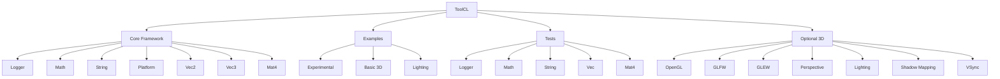
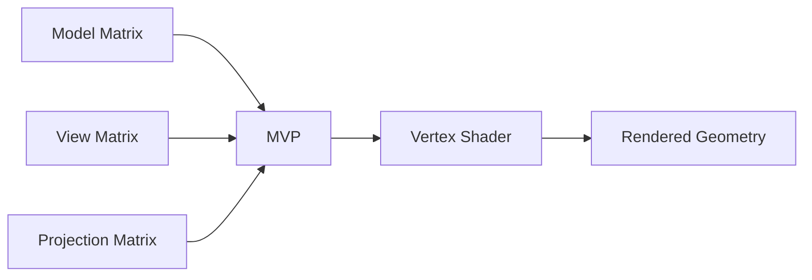
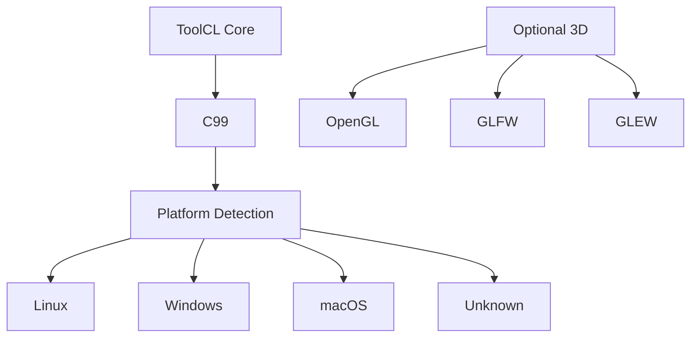

<div align="center">

# ToolCL

### Keep it small. Keep it portable. Keep it simple.

A lightweight C99 framework for building portable applications with modular utilities, mathematics, logging, strings, vectors, matrices, platform detection and optional 3D/OpenGL examples.

[](https://github.com/ToolGits/ToolCL/releases)
[](https://en.cppreference.com/w/c)
[](https://cmake.org/)
[](LICENSE)
[](#portability)

</div>

---

> [!NOTE]
> **ToolCL v0.4.5** is the current stable release.

> [!TIP]
> ToolCL is designed around a simple idea: provide useful building blocks without turning a small C project into a giant dependency tree.

> [!IMPORTANT]
> The ToolCL core does not require OpenGL, GLFW or GLEW. The 3D stack is optional and controlled through CMake options.

> [!WARNING]
> **Windows and macOS support are planned for ToolCL v0.5.0.**
> ToolCL v0.4.5 is currently developed and validated primarily on Linux. Official Windows and macOS support, including platform-specific support and official builds, is planned for v0.5.0.

> [!WARNING]
> **ToolCL is not a complete game engine or 3D framework.**
> The ToolCL core was not designed specifically for 3D rendering. Its vector and matrix modules provide general mathematical building blocks, while the optional 3D examples demonstrate how they can be used with OpenGL.

---

## Table of Contents

- [Overview](#overview)
- [Why ToolCL?](#why-toolcl)
- [Features](#features)
- [Architecture](#architecture)
- [Modules](#modules)
- [3D Foundation](#3d-foundation)
- [Examples](#examples)
- [Requirements](#requirements)
- [Building](#building)
- [CMake Options](#cmake-options)
- [CMake Presets](#cmake-presets)
- [Testing](#testing)
- [Continuous Integration](#continuous-integration)
- [Basic Usage](#basic-usage)
- [Project Structure](#project-structure)
- [Portability](#portability)
- [Development](#development)
- [ToolGits](#toolgits)
- [License](#license)

---

# Overview

**ToolCL** is a lightweight C99 framework created by **enzobobdevvideos04-ctrl** and maintained within the **ToolGits** organization.

It provides a small collection of reusable building blocks for C applications while keeping the core simple, modular and dependency-light.

ToolCL is intentionally focused. It is not designed to become a framework that attempts to solve every possible problem in C.

### ToolCL Architecture at a Glance

| Layer | Components | Purpose |
|---|---|---|
| **Core** | `Logger` · `Math` · `String` · `Platform` | Fundamental utilities and platform foundation |
| **Vectors** | `Vec2` · `Vec3` | 2D and 3D vector mathematics |
| **Matrices** | `Mat4` | 4×4 transformations and 3D mathematics |
| **3D Layer** | `OpenGL` · `GLFW` · `GLEW` | Optional real-time 3D examples |
| **Examples** | Basic · Experimental · 3D | Usage and demonstrations |
| **Tests** | Logger · Math · String · Vec · Mat4 | Automated validation |

<details>
<summary><strong>ToolCL structure</strong></summary>

```text
ToolCL
│
├── Core
│   ├── Logger
│   ├── Math
│   ├── String
│   └── Platform
│
├── Mathematics
│   ├── Vec2
│   ├── Vec3
│   └── Mat4
│
├── Optional 3D Layer
│   ├── OpenGL
│   ├── GLFW
│   └── GLEW
│
├── Examples
│   ├── Experimental
│   └── 3D
│
└── Tests
    ├── Logger
    ├── Math
    ├── String
    ├── Vec
    └── Mat4
```

</details>

The architecture is intentionally modular: applications can use the core functionality without enabling the optional 3D layer.

> [!NOTE]
> OpenGL, GLFW and GLEW are **not required by the ToolCL core**. They are only introduced when the optional 3D examples are enabled.

---

# Why ToolCL?

ToolCL was created to provide a small and practical foundation for C applications without introducing unnecessary complexity.

### Small by design

ToolCL focuses on useful building blocks instead of trying to provide everything in a single framework.

### Portable by default

Built around **C99** and a small dependency footprint, ToolCL is designed to keep applications portable across different environments.

### Modular

Logging, mathematics, strings, vectors, matrices and platform detection are organized as independent components, allowing the framework to grow without becoming unnecessarily difficult to maintain.

### Optional 3D

The core does not depend on graphics libraries. OpenGL, GLFW and GLEW are only introduced when the optional 3D examples are enabled.

### Tested

ToolCL includes automated tests for its core components, including mathematical edge cases, vector operations and matrix transformations.

### Built to stay simple

ToolCL follows a straightforward philosophy:

> **Keep it small. Keep it portable. Keep it simple.**

---

# Features

## Core

- C99-compatible framework
- Static `toolcl` build target
- Lightweight implementation
- Modular headers
- Logging system
- Mathematical helpers
- String utilities
- Platform detection
- 2D and 3D vector mathematics
- 4×4 matrix mathematics
- Linear interpolation
- Angle conversion
- Transform utilities
- Automated tests
- Minimal mandatory dependencies

## Mathematics

The mathematical foundation includes:

- Basic floating-point arithmetic
- Safe division behavior
- Absolute values
- Minimum and maximum values
- Clamping
- Linear interpolation
- Trigonometric helpers
- Square-root handling
- Degree/radian conversion
- Vector length
- Vector distance
- Dot products
- Cross products
- Vector normalization

The vector implementations use `hypotf`-based length and distance calculations for more robust floating-point behavior.

## Matrix Transformations

`Mat4` provides the foundation required by the 3D examples:

- Identity matrices
- Zero matrices
- Matrix multiplication
- Translation
- Scaling
- X/Y/Z rotations
- Perspective projection
- 3D vector transformation

Perspective construction validates its input parameters before producing a matrix.

## Platform

The platform module provides basic platform identification for the ToolCL core.

Currently recognized platforms include:

- Linux
- Windows
- macOS
- Unknown

Platform detection is intentionally lightweight and keeps platform identification separate from higher-level framework functionality.

Official platform-specific support and builds for Windows and macOS are planned for **v0.5.0**.

## 3D

The optional 3D layer provides examples using:

- OpenGL
- GLFW
- GLEW
- GLSL
- Perspective projection
- Model/View/Projection transformations
- Directional lighting
- Shadow mapping
- PCF filtering
- Basic specular lighting
- Polygon offset
- VSync variants

## Build System

- CMake 3.25+
- CMake Presets
- Optional examples
- Optional 3D examples
- Optional tests
- Optional 3D dependency fetching
- `pkg-config` integration when available
- C99 extensions disabled for a standard C99 build

---

# Architecture


```mermaid
flowchart TD
    A[ToolCL] --> B[Core Framework]
    A --> C[Examples]
    A --> D[Tests]
    A --> E[Optional 3D]

    B --> B1[Logger]
    B --> B2[Math]
    B --> B3[String]
    B --> B4[Platform]
    B --> B5[Vec2]
    B --> B6[Vec3]
    B --> B7[Mat4]

    C --> C1[Experimental]
    C --> C2[Basic 3D]
    C --> C3[Lighting]

    D --> D1[Logger]
    D --> D2[Math]
    D --> D3[String]
    D --> D4[Vec]
    D --> D5[Mat4]

    E --> E1[OpenGL]
    E --> E2[GLFW]
    E --> E3[GLEW]

    E --> E4[Perspective]
    E --> E5[Lighting]
    E --> E6[Shadow Mapping]
    E --> E7[VSync]
```

The framework is split into two major areas:

```text
ToolCL
│
├── Core
│   ├── Logger
│   ├── Math
│   ├── String
│   ├── Platform
│   ├── Vec2
│   ├── Vec3
│   └── Mat4
│
└── Optional 3D Examples
    ├── OpenGL
    ├── GLFW
    └── GLEW
```

This separation keeps the core independent from graphics-specific dependencies.

---

# Modules

| Module | Header | Purpose |
|---|---|---|
| Logger | `toolcl/logger.h` | Logging and log levels |
| Math | `toolcl/math.h` | Mathematical helpers |
| String | `toolcl/string.h` | String utilities |
| Platform | `toolcl/platform.h` | Platform identification |
| Vec2 | `toolcl/vec2.h` | 2D vector operations |
| Vec3 | `toolcl/vec3.h` | 3D vector operations |
| Mat4 | `toolcl/mat4.h` | 4×4 matrix operations |

## Logger

The logger provides lightweight diagnostic output with multiple log levels.

Available levels include:

- `DEBUG`
- `INFO`
- `WARN`
- `ERROR`

A configurable minimum log level can be used to ignore messages below the selected level.

---

## Math

The math module provides common floating-point utilities used by the rest of the framework.

It includes:

- Arithmetic
- Absolute values
- Minimum/maximum
- Clamping
- Linear interpolation
- Trigonometry
- Square roots
- Degree/radian conversion

It also defines:

```c
TOOLCL_PI
```

The implementation handles important edge cases such as division by zero, negative square-root input and inverted clamp bounds.

---

## String

The string module provides lightweight helpers for common string operations.

It is intended to complement the C standard library rather than replace it with a large abstraction layer.

---

## Platform

The platform module provides a small platform detection API.

```c
#include <toolcl/platform.h>

ToolCL_Platform platform = toolcl_get_platform();
```

The current platform identifiers are:

```c
TOOLCL_PLATFORM_LINUX
TOOLCL_PLATFORM_WINDOWS
TOOLCL_PLATFORM_MACOS
TOOLCL_PLATFORM_UNKNOWN
```

The implementation uses compiler-provided platform macros to identify the current target.

Platform detection is already part of the ToolCL core, while the broader platform-specific support and official builds for Windows and macOS are planned for **v0.5.0**.

---

## Vec2

`ToolCL_Vec2` provides 2D vector functionality.

The module covers:

- Construction
- Addition
- Subtraction
- Scalar multiplication
- Length
- Dot product
- Distance
- Normalization

Zero-length normalization is handled explicitly.

---

## Vec3

`ToolCL_Vec3` provides 3D vector functionality.

The module covers:

- Construction
- Addition
- Subtraction
- Scalar multiplication
- Length
- Dot product
- Distance
- Cross product
- Normalization

Length and distance calculations use `hypotf` to improve numerical robustness.

---

## Mat4

`ToolCL_Mat4` provides 4×4 matrix functionality used by the 3D examples.

The module covers:

- Zero matrices
- Identity matrices
- Matrix multiplication
- Translation
- Scaling
- X/Y/Z rotations
- Perspective projection
- 3D vector transformation

Perspective matrices validate:

- Field of view
- Aspect ratio
- Near plane
- Far plane
- Finite floating-point values

Transformation also protects against non-finite homogeneous `w` values.

---

# 3D Foundation

ToolCL includes an optional OpenGL-based 3D example layer.

The 3D examples demonstrate how the core mathematics components can be combined with a conventional OpenGL rendering pipeline.

## 3D Stack

| Component | Role |
|---|---|
| OpenGL | Rendering API |
| GLFW | Window and context management |
| GLEW | OpenGL function loading |
| GLSL | Shader programming |
| ToolCL Vec2/Vec3 | Vector mathematics |
| ToolCL Mat4 | Transformation and projection mathematics |

---

## Rendering Pipeline

The examples use the conventional transformation flow:

```text
Model
  │
  ▼
View
  │
  ▼
Projection
  │
  ▼
Clip Space
  │
  ▼
Rasterization
  │
  ▼
Fragment Processing
```

The mathematical foundation is supplied by ToolCL while OpenGL handles the actual rendering pipeline.

---

## Perspective Projection

The 3D examples use perspective projection based on:

```text
Field of View
Aspect Ratio
Near Plane
Far Plane
```

Invalid values are rejected by `toolcl_mat4_perspective()` rather than producing an invalid projection matrix.

The implementation checks for:

- Non-positive aspect ratios
- Invalid near planes
- Invalid far planes
- `far <= near`
- Non-finite values
- Invalid tangent results

---

## Model / View / Projection

The examples use the standard MVP concept:


```mermaid
flowchart LR
    A[Model Matrix] --> D[MVP]
    B[View Matrix] --> D
    C[Projection Matrix] --> D
    D --> E[Vertex Shader]
    E --> F[Rendered Geometry]
```

`Mat4` supplies the transformation operations required to build these matrices.

---

## Lighting

The lighting examples demonstrate a basic directional-light pipeline.

The fragment stage can combine:

```text
Ambient
   +
Diffuse
   +
Specular
   +
Shadow
   │
   ▼
Final Fragment Color
```

The examples are intentionally focused demonstrations rather than a complete rendering engine.

---

## Shadow Mapping

The advanced lighting examples demonstrate shadow mapping using a depth texture generated from the light's point of view.

```text
Light
  │
  ▼
Light-Space Transform
  │
  ▼
Depth Pass
  │
  ▼
Shadow Map
  │
  ▼
Scene Rendering
  │
  ▼
Depth Comparison
  │
  ▼
Shadow Factor
```

The lighting examples also demonstrate **PCF filtering** to reduce hard shadow-map edges.

Polygon offset is used to help reduce common depth-related artifacts such as shadow acne.

---

## VSync

The VSync variants demonstrate rendering synchronized with the display refresh cycle.

Available variants include:

- `hello_3d_vsync`
- `hello_3d_lighting_vsync`

The corresponding non-VSync examples are also available for comparison.

---

# Examples

ToolCL includes examples ranging from minimal applications to complete OpenGL demonstrations.

## Basic Examples

### `hello_world`

A minimal ToolCL application demonstrating basic framework usage.

### `hello_random`

A small example demonstrating basic operations with generated values.

---

## 3D Examples

| Target | Description |
|---|---|
| `hello_3d` | Basic OpenGL 3D rendering |
| `hello_3d_vsync` | Basic 3D rendering with VSync |
| `hello_3d_lighting` | 3D rendering with lighting and shadows |
| `hello_3d_lighting_vsync` | Lighting, shadows and VSync |

The repository also contains focused example source files for individual modules.

---

# Requirements

## Core

Required:

- C99-compatible compiler
- CMake 3.25 or newer
- Standard C library
- `libm` on Unix-like systems

## 3D Examples

Required when `TOOLCL_BUILD_3D=ON`:

- OpenGL development files
- GLFW
- GLEW

When available, `pkg-config` can be used to locate system-installed GLFW and GLEW packages.

If the dependencies are unavailable and dependency fetching is enabled, CMake can obtain them automatically through `FetchContent`.

> [!NOTE]
> The core framework and its tests can be built without the OpenGL development stack by disabling the 3D examples.

---

# Building

Clone the repository:

```bash
git clone https://github.com/ToolGits/ToolCL.git
cd ToolCL
```

Configure:

```bash
cmake -S . -B build
```

Build:

```bash
cmake --build build -j"$(nproc)"
```

Run the tests:

```bash
ctest --test-dir build --output-on-failure
```

---

## Full Build

To build the core, examples, 3D examples and tests:

```bash
rm -rf build && \
cmake -S . -B build \
  -DTOOLCL_BUILD_EXAMPLES=ON \
  -DTOOLCL_BUILD_3D=ON \
  -DTOOLCL_BUILD_TESTS=ON && \
cmake --build build -j"$(nproc)" && \
ctest --test-dir build --output-on-failure
```

---

## Core-Only Build

For environments without the optional graphics stack:

```bash
cmake -S . -B build \
  -DTOOLCL_BUILD_EXAMPLES=ON \
  -DTOOLCL_BUILD_3D=OFF \
  -DTOOLCL_BUILD_TESTS=ON

cmake --build build -j"$(nproc)"
ctest --test-dir build --output-on-failure
```

---

# CMake Options

| Option | Default | Description |
|---|---:|---|
| `TOOLCL_BUILD_EXAMPLES` | `ON` | Build example programs |
| `TOOLCL_BUILD_3D` | `ON` | Build optional OpenGL 3D examples |
| `TOOLCL_BUILD_TESTS` | `ON` | Build and register tests |
| `TOOLCL_FETCH_3D_DEPS` | `ON` | Fetch GLFW/GLEW when unavailable |

For example, to build only the core and tests:

```bash
cmake -S . -B build \
  -DTOOLCL_BUILD_EXAMPLES=OFF \
  -DTOOLCL_BUILD_3D=OFF \
  -DTOOLCL_BUILD_TESTS=ON
```

---

# CMake Presets

ToolCL includes `CMakePresets.json` with configurations for common development scenarios.

## Debug

```bash
cmake --preset debug
cmake --build --preset debug
ctest --preset debug
```

Configuration:

| Setting | Value |
|---|---|
| Build type | Debug |
| Tests | ON |
| Examples | ON |
| 3D | OFF |

The debug preset keeps the graphics stack disabled, making it suitable for core development and testing environments without OpenGL development dependencies.

---

## Release

```bash
cmake --preset release
cmake --build --preset release
ctest --preset release
```

Configuration:

| Setting | Value |
|---|---|
| Build type | Release |
| Tests | ON |
| Examples | ON |
| 3D | OFF |

---

## 3D

```bash
cmake --preset 3d
cmake --build --preset 3d
ctest --preset 3d
```

Configuration:

| Setting | Value |
|---|---|
| Build type | Release |
| Tests | ON |
| Examples | ON |
| 3D | ON |
| Fetch 3D dependencies | ON |

The 3D preset is intended for environments where the OpenGL development stack is available or can be fetched automatically.

---

# Testing

ToolCL uses CTest for automated validation.

The current suite contains five test targets:

| Test | Coverage |
|---|---|
| `test_logger` | Logger behavior |
| `test_math` | Mathematical utilities and edge cases |
| `test_string` | String utilities |
| `test_vec` | Vec2 and Vec3 operations |
| `test_mat4` | Matrix operations and transformations |

Run the complete suite with:

```bash
ctest --test-dir build --output-on-failure
```

Or use a preset:

```bash
ctest --preset debug
```

## Current Test Coverage

The test suite includes edge cases such as:

### Math

- Division by zero
- Negative square roots
- Inverted clamp bounds
- Basic arithmetic
- Interpolation
- Angle conversion

### Vectors

- Length
- Distance
- Dot product
- Cross product
- Normalization
- Zero-vector normalization
- Arithmetic operations

### Matrices

- Identity
- Zero matrices
- Multiplication
- Translation
- Scaling
- Rotation
- Perspective projection
- Invalid perspective parameters
- Vector transformation
- Non-finite homogeneous values

> [!NOTE]
> The current **v0.4.5** core test suite contains five test targets, with all five passing.

```text
5/5 tests passing
100% tests passed
```

---

# Continuous Integration

ToolCL uses automated CI to validate the project across multiple Linux environments and compilers.

The CI matrix currently covers:

| Environment | GCC | Clang | 3D Build | Tests |
|---|:---:|:---:|:---:|:---:|
| Ubuntu | ✓ | ✓ | ✓ | ✓ |
| Arch Linux | ✓ | ✓ | ✓ | ✓ |

The CI builds the core, examples and optional 3D targets.

The graphical examples are **compiled and linked**, but CI does not launch graphical applications.

## Ubuntu

The Ubuntu CI environment installs the required development packages for:

- CMake
- Ninja
- `pkg-config`
- Mesa OpenGL development files
- GLFW
- GLEW

## Arch Linux

The Arch Linux CI environment uses the current Arch packages for:

- CMake
- Ninja
- `pkgconf`
- GCC
- Clang
- Mesa
- GLFW
- GLEW

Both environments run the same CMake configuration and test workflow, with only the platform-specific dependency installation differing.

CI disables automatic 3D dependency fetching so that the installed system packages are explicitly validated.

---

# Basic Usage

A minimal ToolCL application can look like this:

```c
#include <toolcl/logger.h>
#include <toolcl/vec3.h>

int main(void)
{
    ToolCL_Vec3 a = toolcl_vec3(1.0f, 2.0f, 3.0f);
    ToolCL_Vec3 b = toolcl_vec3(4.0f, 5.0f, 6.0f);

    ToolCL_Vec3 result = toolcl_vec3_add(a, b);

    toolcl_log_info(
        "Result: %.2f %.2f %.2f",
        result.x,
        result.y,
        result.z
    );

    return 0;
}
```

Link the application against the `toolcl` CMake target:

```cmake
add_executable(my_app main.c)

target_link_libraries(
    my_app
    PRIVATE
    toolcl
)
```

The framework exposes its public headers through:

```text
include/toolcl/
```

---

# Project Structure

```text
ToolCL/
├── CMakeLists.txt
├── CMakePresets.json
├── LICENSE
├── README.md
│
├── include/
│   └── toolcl/
│       ├── logger.h
│       ├── math.h
│       ├── string.h
│       ├── platform.h
│       ├── vec2.h
│       ├── vec3.h
│       └── mat4.h
│
├── src/
│   ├── logger.c
│   ├── math.c
│   ├── string.c
│   ├── platform.c
│   ├── vec2.c
│   ├── vec3.c
│   └── mat4.c
│
├── examples/
│   ├── experimental/
│   │   ├── hello_world.c
│   │   └── hello_random.c
│   │
│   └── 3d/
│       ├── hello_3d.c
│       ├── hello_3d_vsync.c
│       ├── hello_3d_lighting.c
│       └── hello_3d_lighting_vsync.c
│
└── tests/
    ├── test_logger.c
    ├── test_math.c
    ├── test_string.c
    ├── test_vec.c
    └── test_mat4.c
```

---

# Portability

ToolCL is designed around C99 and a lightweight dependency model.

The core intentionally avoids graphics-specific dependencies, allowing it to be used in environments where an OpenGL development stack is unavailable.

The platform layer currently identifies:

```text
Linux
Windows
macOS
Unknown
```


```mermaid
flowchart TD
    A[ToolCL Core] --> B[C99]
    B --> C[Platform Detection]

    C --> D[Linux]
    C --> E[Windows]
    C --> F[macOS]
    C --> G[Unknown]

    H[Optional 3D] --> I[OpenGL]
    H --> J[GLFW]
    H --> K[GLEW]
```

## Current Platform Status

| Platform | v0.4.5 | v0.5.0 |
|---|---|---|
| Linux | Primary development and validation | Supported |
| Windows | Portability in development | Official support |
| macOS | Portability in development | Official support |

> [!NOTE]
> Platform detection for Linux, Windows and macOS is already present in the ToolCL core. Official Windows and macOS support will be completed in v0.5.0 with platform-specific support and official builds.

## Linux

Linux is currently the primary development and validation environment for ToolCL.

The core can be built without the optional 3D dependencies.

## Windows

Windows is part of ToolCL's official platform roadmap.

The current v0.4.5 release contains platform detection for Windows, while the complete platform-specific support and official builds are planned for v0.5.0.

## macOS

macOS is part of ToolCL's official platform roadmap.

The current v0.4.5 release contains platform detection for macOS, while the complete platform-specific support and official builds are planned for v0.5.0.

> [!IMPORTANT]
> ToolCL v0.4.5 should not be interpreted as an officially supported Windows or macOS release. Those platforms become officially supported with v0.5.0.

---

# Development

ToolCL development follows a few practical principles.

## Keep the Core Focused

New functionality should have a clear purpose within the framework.

ToolCL should not grow simply for the sake of adding more features.

## Prefer Portable C

The framework targets C99 and avoids unnecessary compiler-specific functionality whenever a portable solution is practical.

## Test Changes

Changes to core functionality should be validated through the existing test suite.

The normal development cycle is:

```text
Change
  │
  ▼
Build
  │
  ▼
Test
  │
  ▼
Validate
```

## Validate Edge Cases

Small utility functions can still fail in important ways when given unusual input.

ToolCL therefore explicitly tests cases involving:

- Zero values
- Invalid ranges
- Division by zero
- Negative square-root input
- Zero-length vectors
- Invalid perspective parameters
- Non-finite floating-point values

## Keep Examples Focused

The examples are demonstrations of ToolCL functionality.

The 3D examples demonstrate the interaction between ToolCL mathematics and OpenGL, but ToolCL is not intended to be a complete game engine or graphics engine.

## Platform Development

Platform support is developed incrementally.

The current release establishes the platform detection foundation, while **v0.5.0** expands that foundation into official Windows and macOS support with platform-specific code and official builds.

---

# ToolGits

ToolCL is an independent project maintained within the **ToolGits** organization.

**Organization:** [ToolGits](https://github.com/ToolGits)

**Creator:** [enzobobdevvideos04-ctrl](https://github.com/enzobobdevvideos04-ctrl)

ToolGits provides the organizational home for ToolCL, while ToolCL remains its own independent project with its own source tree, release cycle and license.

---

# License

ToolCL is released under the **MIT License**.

See [`LICENSE`](LICENSE) for the complete license text.

---

<div align="center">

### ToolCL

**Keep it small. Keep it portable. Keep it simple.**

Created by [enzobobdevvideos04-ctrl](https://github.com/enzobobdevvideos04-ctrl)

Maintained under [ToolGits](https://github.com/ToolGits)

</div> 