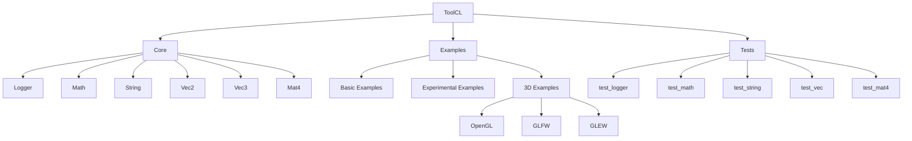

# ToolCL

<div align="center">

**Keep it small. Keep it portable. Keep it simple.**

A lightweight and modular **C99 framework** for building practical C applications.

[](https://github.com/ToolGits/ToolCL/releases)
[](https://en.wikipedia.org/wiki/C99)
[](https://cmake.org/)
[](LICENSE)

</div>

---

## Table of Contents

- [Overview](#overview)
- [Why ToolCL?](#why-toolcl)
- [Features](#features)
- [Architecture](#architecture)
- [Modules](#modules)
- [3D Foundation](#3d-foundation)
- [Examples](#examples)
- [Requirements](#requirements)
- [Building](#building)
- [CMake Options](#cmake-options)
- [CMake Presets](#cmake-presets)
- [Testing](#testing)
- [Basic Usage](#basic-usage)
- [Project Structure](#project-structure)
- [Portability](#portability)
- [Development](#development)
- [ToolGits](#toolgits)
- [License](#license)

---

# Overview

ToolCL is a small, modular framework written in **C99**, designed to provide practical building blocks for C applications without forcing a large or complicated architecture.

The framework currently provides:

- Logging
- Mathematical utilities
- String utilities
- 2D vectors
- 3D vectors
- 4×4 matrices
- Optional OpenGL-based 3D examples
- Automated tests
- CMake-based builds and presets

The project is organized so that the core remains independent from the optional graphics layer.

---

# Why ToolCL?

ToolCL was created to provide a small and practical foundation for C applications without introducing unnecessary complexity.

### Small by design

ToolCL focuses on useful building blocks instead of trying to provide everything in a single framework.

### Portable by default

Built around C99 and minimal dependencies, ToolCL is designed to keep applications portable across platforms.

### Modular

Components such as logging, mathematics, strings, vectors and matrices are organized independently, allowing the framework to grow without becoming unnecessarily complex.

### Optional 3D

The core does not depend on graphics libraries. OpenGL, GLFW and GLEW are only introduced when the optional 3D examples are enabled.

### Tested

ToolCL includes automated tests for its core components, helping catch regressions as the framework evolves.

### Built to stay simple

ToolCL follows a straightforward philosophy:

> **Keep it small. Keep it portable. Keep it simple.**

---

# Features

- **C99 framework**
- Modular core components
- Logging utilities
- Mathematical helpers
- Vec2 and Vec3 types
- Mat4 transformations and perspective projection
- Optional OpenGL 3D examples
- VSync examples
- Lighting examples
- Automated CTest integration
- CMake presets for common build configurations
- Optional dependency fetching for 3D examples

---

# Architecture

ToolCL separates its core components from optional graphics examples.


```mermaid
graph TD
    A[ToolCL] --> B[Core]
    A --> C[Examples]
    A --> D[Tests]

    B --> B1[Logger]
    B --> B2[Math]
    B --> B3[String]
    B --> B4[Vec2]
    B --> B5[Vec3]
    B --> B6[Mat4]

    C --> C1[Basic Examples]
    C --> C2[Experimental Examples]
    C --> C3[3D Examples]

    C3 --> G1[OpenGL]
    C3 --> G2[GLFW]
    C3 --> G3[GLEW]

    D --> D1[test_logger]
    D --> D2[test_math]
    D --> D3[test_string]
    D --> D4[test_vec]
    D --> D5[test_mat4]
```

The core framework does not require OpenGL, GLFW or GLEW.

---

# Modules

| Module | Purpose |
|---|---|
| `logger` | Logging and diagnostic messages |
| `math` | Mathematical utilities and conversions |
| `string` | String-related utilities |
| `vec2` | 2D vector operations |
| `vec3` | 3D vector operations |
| `mat4` | 4×4 matrix operations and transformations |

The modules are exposed through headers under:

```text
include/toolcl/
```

---

# 3D Foundation

ToolCL includes an optional 3D layer built around OpenGL.

The 3D examples are kept separate from the core so applications that only need the basic framework do not have to depend on graphics libraries.

### 3D components

| Example | Dependencies |
|---|---|
| `hello_3d` | ToolCL + GLFW + OpenGL |
| `hello_3d_vsync` | ToolCL + GLFW + OpenGL |
| `hello_3d_lighting` | ToolCL + GLFW + OpenGL + GLEW |
| `hello_3d_lighting_vsync` | ToolCL + GLFW + OpenGL + GLEW |

### Graphics features

The current 3D examples demonstrate:

- OpenGL context creation
- Basic rendering
- VSync
- Lighting
- Matrix transformations
- Vertex processing
- Shader-based rendering

The 3D layer can be disabled completely with:

```text
-DTOOLCL_BUILD_3D=OFF
```

---

# Examples

ToolCL contains examples for both the core modules and the optional 3D layer.

### Core examples

```text
hello_logger
hello_math
hello_string
hello_vec2
```

### Experimental examples

```text
hello_world
hello_random
```

### 3D examples

```text
hello_3d
hello_3d_vsync
hello_3d_lighting
hello_3d_lighting_vsync
```

The examples are built through CMake when `TOOLCL_BUILD_EXAMPLES` is enabled.

---

# Requirements

### Core

- C99-compatible compiler
- CMake **3.25 or newer**

### 3D examples

- OpenGL development libraries
- GLFW
- GLEW

`pkg-config` can be used to locate installed GLFW and GLEW packages.

When enabled, CMake can also fetch missing 3D dependencies automatically.

---

# Building

Clone the repository:

```bash
git clone https://github.com/ToolGits/ToolCL.git
cd ToolCL
```

Configure a normal build:

```bash
cmake -S . -B build
```

Build:

```bash
cmake --build build
```

Run the tests:

```bash
ctest --test-dir build --output-on-failure
```

### Build without 3D

```bash
cmake -S . -B build \
    -DTOOLCL_BUILD_3D=OFF
```

### Full build

```bash
cmake -S . -B build \
    -DTOOLCL_BUILD_EXAMPLES=ON \
    -DTOOLCL_BUILD_3D=ON \
    -DTOOLCL_BUILD_TESTS=ON

cmake --build build -j"$(nproc)"
ctest --test-dir build --output-on-failure
```

---

# CMake Options

| Option | Default | Description |
|---|---:|---|
| `TOOLCL_BUILD_EXAMPLES` | `ON` | Build examples |
| `TOOLCL_BUILD_3D` | `ON` | Build OpenGL 3D examples |
| `TOOLCL_BUILD_TESTS` | `ON` | Build automated tests |
| `TOOLCL_FETCH_3D_DEPS` | `ON` | Fetch missing GLFW/GLEW dependencies |

For example:

```bash
cmake -S . -B build \
    -DTOOLCL_BUILD_EXAMPLES=OFF \
    -DTOOLCL_BUILD_TESTS=ON
```

---

# CMake Presets

ToolCL provides three main presets.

| Preset | Build Type | Tests | Examples | 3D |
|---|---|---:|---:|---:|
| `debug` | Debug | Yes | Yes | No |
| `release` | Release | Yes | Yes | No |
| `3d` | Release | Yes | Yes | Yes |

### Debug

```bash
cmake --preset debug
cmake --build --preset debug
ctest --preset debug
```

### Release

```bash
cmake --preset release
cmake --build --preset release
ctest --preset release
```

### 3D

```bash
cmake --preset 3d
cmake --build --preset 3d
ctest --preset 3d
```

---

# Testing

ToolCL uses **CTest** for automated testing.

Current test suite:

```text
test_logger
test_math
test_string
test_vec
test_mat4
```

Run all tests with:

```bash
ctest --test-dir build --output-on-failure
```

The core test suite covers normal operations as well as edge cases such as:

- Division by zero
- Negative square roots
- Inverted clamp bounds
- Zero-vector normalization
- Vector length and distance
- Matrix multiplication
- Matrix transformations
- Invalid perspective parameters
- Non-finite matrix values

The current test suite has been validated successfully with:

```text
100% tests passed out of 5
```

---

# Basic Usage

A minimal ToolCL program can include the framework headers directly:

```c
#include <toolcl/logger.h>
#include <toolcl/vec3.h>

int main(void)
{
    ToolCL_Vec3 position = toolcl_vec3(1.0f, 2.0f, 3.0f);

    toolcl_log_info(
        "Position: %.2f %.2f %.2f",
        position.x,
        position.y,
        position.z
    );

    return 0;
}
```

The framework is linked through the `toolcl` CMake target:

```cmake
add_executable(my_app main.c)

target_link_libraries(
    my_app
    PRIVATE
    toolcl
)
```

---

# Project Structure

```text
ToolCL/
├── CMakeLists.txt
├── CMakePresets.json
├── LICENSE
├── README.md
│
├── include/
│   └── toolcl/
│       ├── logger.h
│       ├── math.h
│       ├── string.h
│       ├── vec2.h
│       ├── vec3.h
│       └── mat4.h
│
├── src/
│   ├── logger.c
│   ├── math.c
│   ├── string.c
│   ├── vec2.c
│   ├── vec3.c
│   └── mat4.c
│
├── examples/
│   ├── hello_logger.c
│   ├── hello_math.c
│   ├── hello_string.c
│   ├── hello_vec2.c
│   │
│   ├── 3d/
│   │   ├── hello_3d.c
│   │   ├── hello_3d_vsync.c
│   │   ├── hello_3d_lighting.c
│   │   └── hello_3d_lighting_vsync.c
│   │
│   └── experimental/
│       ├── hello_world.c
│       └── hello_random.c
│
└── tests/
    ├── test_logger.c
    ├── test_math.c
    ├── test_string.c
    ├── test_vec.c
    └── test_mat4.c
```

---

# Portability

ToolCL is designed around standard C99 and a small dependency surface.

The core framework does not require a graphics stack.

The optional 3D examples introduce platform-specific graphics dependencies only when requested.

Platform support continues to evolve as the framework is tested and validated across different environments.

---

# Development

ToolCL uses CMake as its build system and keeps development workflows separated through presets.

A typical development cycle is:

```bash
cmake --preset debug
cmake --build --preset debug
ctest --preset debug
```

For 3D development:

```bash
cmake --preset 3d
cmake --build --preset 3d
ctest --preset 3d
```

When adding or modifying a component, the corresponding tests should be updated alongside the implementation.

---

# ToolGits

ToolCL is developed under the **ToolGits** organization.

**Organization:** [ToolGits](https://github.com/ToolGits)

**Creator:** [enzobobdevvideos04-ctrl](https://github.com/enzobobdevvideos04-ctrl)

ToolCL was created by **enzobobdevvideos04-ctrl** as part of the ToolGits project ecosystem.

---

# License

ToolCL is released under the **MIT License**.

See [`LICENSE`](LICENSE) for the complete license text.

---

<div align="center">

### ToolCL

**Keep it small. Keep it portable. Keep it simple.**

Created by [enzobobdevvideos04-ctrl](https://github.com/enzobobdevvideos04-ctrl)

Part of [ToolGits](https://github.com/ToolGits)

</div>